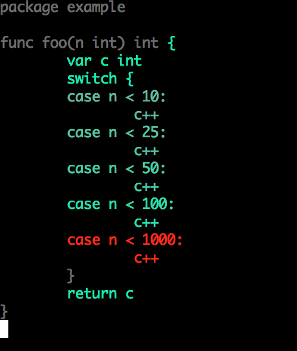

coverage.el generates code coverage profiles and overlays them in GNU
Emacs buffers.

Adding support for new languages and tools is easy. Currently
coverage.el supports Go coverage profiles, gcov profiles, and lcov
profiles.

# Installation

Add to .emacs.el

    (add-to-list 'load-path "/path/to/coverage/directory")
    (require 'coverage)

The package requires GNU Emacs 24.3+.

To test the package after installation

* open coverage-test.el
* Run eval-buffer (M-x eval-buffer RET)
* Run ert (M-x ert RET t RET)

# Usage

Open and follow instructions in files

* examples/go/example.go
* examples/c/example.c

More information is in the Commentary section in the coverage.el file.

# Contributing

See [CONTRIBUTING.md](CONTRIBUTING.md).

# Disclaimer

This is not an official Google product.
